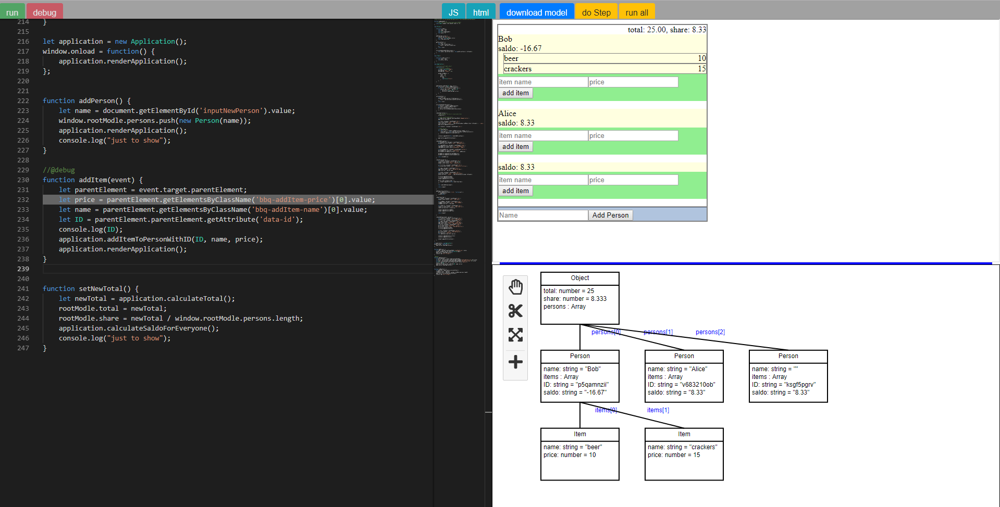
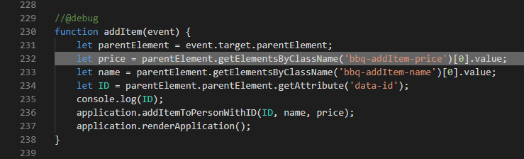
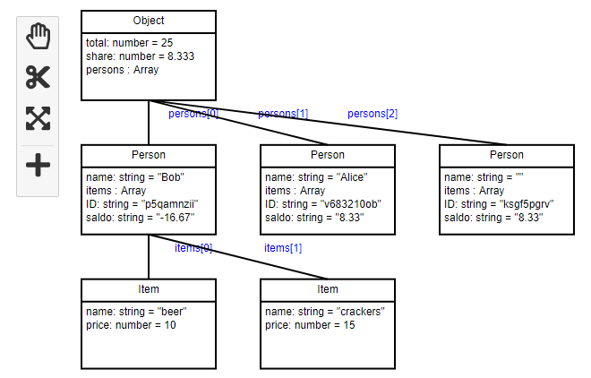

# SimpleDiagramEditor.TS
Curse Software Engeneering 2 Project.

Will be plnkr with diagram editor, hopefully ;)



Global functions can be debugged with annotation '//@debug' on the line before declaration:

```
//@debug
function myFun(arg1, arg2) {
    /*
        here would be the body...
    */
}
```


There is one important limitation: in the body may not be '}' as char. It will be parsed as end of function body. So somethin like if, while, try/catch etc. is not possible at this time of development.

The body will be parsed and the function will get async. After all statements (sparated by ';') will be inserted a promise. The Step button resolves the promise and so debugging is realized. On start of a debug session a message from injected code will be sent to the debugger. 



Highlights:
- highlight current line in debug mode
- the rootModle object is displayed as diagram
- the diagram can be changed (properties, objets, ...)
- there is a 'run all' button in debug mode
- javascript and html can be edited in the code editor
- javascript and html will be injected to the iframe
- demo application: german bbq as showcase

## install
Recomended is using yarn instead of npm.

```
npm install -g typescript
```

```
yarn
```

## develop
Webpack is configured to work with devserver.
Two bundles will be created and injected in demo html. Just run 

```
yarn run dev
```

It starts a webserver with auto bundler and auto browser reload.

## debugging in vscode
- install extension 'Debugger for Chrome' in vs code
- run npm:dev
- launch debug configuration 'Launch Chrome Debugger'

## Build

```
yarn run webpack
```

## Tests
There are some unit tests. Tests can run headless with pupeteer and karma. 
Use for Development in watch-mode:

```
yarn run testdev
```

Use for ci (exit after run wtih exit code):

```
yarn run test
```

## Debugging Tests
VS Code Extension needed: 'Debugger for Chrome'. Test can be debugged through VS Code debugger extension. Just run ```testdev``` script, go to the VS Code debugger and choose Attach Karma Chrome. 

## deployment
Project will be tested, built and deployed by gitlab ci.
You can see the result here:

https://se2-diagram-tools.gitlab.io/SE2_Otte_Joern/